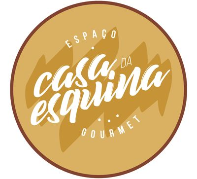

# Casa da Esquina — levantamento para o rebranding e novo site

Pesquisa realizada em **30 de setembro de 2026**, com base no cardápio Acuolina, na página de pedidos PedyUN e no perfil público do Instagram. Este documento reúne a oferta gastronômica, os dados de contato, a identidade atual e os materiais disponíveis para a criação do novo site. Os preços representam o que cada canal mostrava no momento da consulta; as divergências foram preservadas.

## 1. O que é a Casa da Esquina

A **Casa da Esquina** é um estabelecimento gastronômico em **Janaúba, Minas Gerais**, com endereço no Centro da cidade. A oferta reúne petiscos e porções para compartilhar, hambúrgueres, carnes e peixes grelhados, caldos, salada, acompanhamentos, sobremesas e bebidas. O cardápio combina preparações como carne de sol, mandioca, cupim e torresmo com bruschetta, carpaccio, molho chimichurri e arroz piamontese. [Fontes: Acuolina e PedyUN](#9-fontes-e-limites-da-pesquisa).

O nome apresentado no Instagram e no Acuolina é **Casa da Esquina**. O logo usa **Espaço Casa da Esquina Gourmet**. A página de pedidos exibe a variante “CASA DE ESQUINA”, enquanto seu título é “Espaço Casa Da Esquina - Gourmet”. Essa variação de nome precisa ser padronizada na nova identidade.

**Leitura de posicionamento para o projeto, não uma declaração oficial:** a variedade de porções, grelhados, cervejas e a comunicação de funcionamento noturno sugerem um restaurante com proposta de encontro e convivência, além do delivery. Não há evidência suficiente nas páginas acessíveis para afirmar capacidade do salão, serviço de reservas ou características físicas do ambiente.

## 2. Endereço, atendimento e canais

| Informação | Dado observado | Fonte |
|---|---|---|
| Cidade | Janaúba, MG | Acuolina e PedyUN |
| Endereço | Rua Rui Barbosa, 107 — Centro, Janaúba | Acuolina e bio do Instagram |
| Telefone / WhatsApp anunciado | (38) 99944-5000 | Acuolina e bio do Instagram |
| E-mail cadastrado | casaesquinagourmet@gmail.com | Dados públicos da página Acuolina; confirmar antes de publicar |
| Horário anunciado | Terça a domingo, 18h30 às 00h | Bio pública do Instagram |
| Instagram | [@casadaesquinajba](https://www.instagram.com/casadaesquinajba/) | Perfil informado |
| Pedidos online | [PedyUN](https://pedyun.com.br/casadaesquina) | Página de pedidos e link da bio |
| Cardápio digital | [Acuolina](https://acuolina.com/pt/casa-da-esquina/62f81d41237340002367940c) | Cardápio informado |
| Prazo exibido para delivery | 60–120 minutos | PedyUN; indicador dinâmico, não prazo garantido |

O Acuolina contém configuração pública de horários iniciando às 18h e encerrando às 23h ou 00h, dependendo da entrada. Isso difere da bio do Instagram. Para o novo site, validar com o restaurante qual é o horário oficial e se salão e delivery têm horários distintos. A segunda-feira não aparece no intervalo anunciado pela bio; não foi confirmada uma política para feriados.

O perfil do Instagram anuncia o WhatsApp na bio. Um link que pode ser construído a partir do número confirmado é [wa.me/5538999445000](https://wa.me/5538999445000); esta URL é derivada do telefone, não foi testada com envio de mensagem.

## 3. Oferta gastronômica e pratos que ajudam a explicar a casa

| Linha | O que oferece | Exemplos observados |
|---|---|---|
| Petiscos e porções | Entradas, frituras, carnes e combinações para compartilhar | Coxinha de cupim, croquete de costela, dadinho de tapioca, chapa mista, torre de fritas |
| Hambúrgueres | Sanduíches com pão brioche, diferentes carnes e maionese da casa | Burger da Casa, Cheese Bacon, Mexicano, Supremo, La Casa Turbo |
| Grelhados | Bovinos, frango e tilápia com acompanhamentos e molhos | Maminha ao provolone, picanha, cupim rústico, tilápia ao molho de maracujá |
| Caldos | Carne, frango e feijão | Torrada, torresmo e cheiro-verde aparecem nos acompanhamentos |
| Salada | Caesar com frango | Alface, parmesão, croutons e molho Caesar |
| Sobremesas | Chocolate, sorvete e cheesecake | Brownie com sorvete, sorvete da casa com Oreo, cheesecake |
| Bebidas | Refrigerantes, águas, energético, sucos e cervejas | Maracujá, morango, Heineken, Stella Artois, Corona |

O PedyUN lista um hambúrguer **Vegetariano**, de soja e com queijos. A descrição não o caracteriza como vegano. O destaque **Kids** existe no Instagram, e o cardápio apresenta o sanduíche Junior; isso não confirma a existência de espaço infantil. O destaque **Drinks** indica essa frente na comunicação, mas receitas e preços de coquetéis não ficaram disponíveis nas páginas consultadas.

Não foi possível estabelecer quais itens são os mais vendidos, premiados ou “carro-chefe”. Os exemplos acima descrevem a oferta, sem atribuir popularidade não demonstrada.

## 4. Cardápio completo observado no PedyUN

Fonte desta seção: [página de pedidos](https://pedyun.com.br/casadaesquina), consultada em 30/09/2026. Nomes e descrições tiveram ajustes de ortografia para leitura, preservando ingredientes, porções e valores. “Não informada” significa ausência de descrição no canal. As categorias seguem a organização da plataforma, inclusive a mini porção de batata em Hambúrgueres. Há **81 itens** listados, incluindo bebidas, acompanhamentos e meias porções; isso não equivale a 81 pratos diferentes.

### Bebidas

| Produto | Descrição / composição | Preço observado |
|---|---|---|
| Coca 1 litro | Não informada | R$ 12,00 |
| Guaraná 1 litro | Não informada | R$ 10,00 |
| Coca-Cola 350 ml | Não informada | R$ 6,00 |
| Guaraná Antarctica 350 ml | Não informada | R$ 6,00 |
| Sprite 350 ml | Não informada | R$ 6,00 |
| Fanta 350 ml | Não informada | R$ 6,00 |
| H2O | Não informada | R$ 9,00 |
| Água tônica | Não informada | R$ 7,00 |
| Água mineral | Não informada | R$ 3,50 |
| Água mineral com gás | Não informada | R$ 4,50 |
| Red Bull | Não informada | R$ 15,00 |
| Coca-Cola 350 ml zero açúcar | Não informada | R$ 6,00 |

### Hambúrgueres

| Produto | Descrição / composição | Preço observado |
|---|---|---|
| Mini porção de batata | Não informada | R$ 5,00 |
| Cheese Burger | Pão brioche, hambúrguer 140 g, mussarela, alface, cebola roxa e maionese da casa. | R$ 24,00 |
| Cheese Bacon | Pão brioche, hambúrguer 140 g, bacon, mussarela, alface, cebola roxa e maionese da casa. | R$ 26,00 |
| Mexicano | Pão brioche, hambúrguer 140 g, queijo prato, bacon, anéis de cebola empanados, geleia de pimenta e maionese da casa. | R$ 28,00 |
| Burger da Casa | Pão brioche, blend 140 g de carne bovina e suína, mussarela, cebola caramelizada, alface e maionese da casa. | R$ 22,00 |
| Chicken Bacon | Pão brioche, frango filetado 120 g, molho barbecue, mussarela, catupiry, bacon, alface, cebola roxa e maionese da casa. | R$ 22,00 |
| Junior | Pão brioche, hambúrguer 100 g, mussarela, maionese da casa e fritas. | R$ 19,00 |
| Supremo | Pão brioche, 2 hambúrgueres bovinos de 100 g, cheddar cremoso, cebola caramelizada e maionese da casa. | R$ 29,00 |
| Vegetariano | Pão brioche, hambúrguer de soja 150 g recheado com requeijão, mussarela, tomate cereja, alface e maionese da casa. | R$ 16,00 |
| Cheddar Crispy | Pão brioche, hambúrguer 140 g, cheddar cremoso, bacon, cebola crispy e maionese da casa. | R$ 29,00 |
| La Casa Turbo | Pão brioche, blend 140 g de carne bovina e suína, ovo, queijo prato, bacon, alface, tomate, cebola roxa e maionese da casa. | R$ 28,00 |

### Caldos

| Produto | Descrição / composição | Preço observado |
|---|---|---|
| Caldo de carne | Carne de sol desfiada; acompanha torrada, torresmo e cheiro-verde. | R$ 14,00 |
| Caldo de feijão | Acompanha torrada, torresmo e cheiro-verde. | R$ 12,00 |
| Caldo de frango | Frango desfiado; acompanha torrada, torresmo e cheiro-verde. | R$ 12,00 |

### Sucos

| Produto | Descrição / composição | Preço observado |
|---|---|---|
| Suco de maracujá | Não informada | R$ 9,00 |
| Suco de morango | Não informada | R$ 9,00 |

### Cervejas

| Produto | Descrição / composição | Preço observado |
|---|---|---|
| Amstel 600 ml | Não informada | R$ 12,00 |
| Antarctica 600 ml | Não informada | R$ 11,00 |
| Baden Baden 600 ml | Não informada | R$ 23,00 |
| Brahma 600 ml | Não informada | R$ 12,00 |
| Corona long 355 ml | Não informada | R$ 13,00 |
| Heineken 600 ml | Não informada | R$ 17,00 |
| Heineken long neck | Não informada | R$ 12,00 |
| Stella Artois 600 ml | Não informada | R$ 15,00 |
| Stella Artois long neck | Não informada | R$ 12,00 |
| Therezópolis 600 ml | Não informada | R$ 11,00 |

### Petiscos

| Produto | Descrição / composição | Preço observado |
|---|---|---|
| Alcatra com fritas | Não informada | R$ 94,00 |
| Bolinhas de tilápia | Acompanha molho tártaro e molho de pimenta. | R$ 38,00 |
| Bolinho de mandioca | Recheado com carne de sol; acompanha maionese da casa. 6 unidades. | R$ 26,00 |
| Bruschetta al' Basilico | Pão italiano, passata de tomate ao manjericão e gorgonzola. 6 unidades. | R$ 38,00 |
| Carne de sol com mandioca | Não informada | R$ 72,00 |
| Carpaccio de filé mignon | Acompanha torradas. | R$ 39,00 |
| Chapa mista | Carne de sol, lombo suíno, mandioca e batata frita. | R$ 72,00 |
| Coxinha da casa | Sem massa, recheio de frango; acompanha maionese da casa. 6 unidades. | R$ 28,00 |
| Coxinha de cupim | Sem massa, recheio de carne; acompanha creme de cheddar. 10 unidades. | R$ 49,00 |
| Croquete de costela | Acompanha molho de azeitonas e molho do chef. | R$ 38,00 |
| Dadinho de tapioca | Acompanha geleia de pimenta. 12 unidades pequenas. | R$ 19,00 |
| Iscas de peixe à doré | Acompanha molho tártaro e chips de batata-doce. | R$ 59,00 |
| Meia porção de carne de sol com mandioca | Não informada | R$ 49,00 |
| Meia porção de chapa mista | Carne de sol, lombo suíno, mandioca e batata frita. | R$ 49,00 |
| Meia porção de coxinha de cupim | Sem massa, recheio de carne; acompanha creme de cheddar. 5 unidades. | R$ 29,00 |
| Panceta | Acompanha molho barbecue. | R$ 34,00 |
| Pãozinho de alho | Acompanha vinagrete. 6 unidades. | R$ 18,00 |
| Pastéis meia porção | Somente um sabor: carne com requeijão, frango com requeijão ou queijo temperado. 6 unidades. | R$ 20,00 |
| Pastel de carne | Carne com requeijão. 12 unidades. | R$ 32,00 |
| Pastel de frango | Frango com requeijão. 12 unidades. | R$ 32,00 |
| Pastel de queijo | Queijo temperado. 12 unidades. | R$ 32,00 |
| Pastel misto | Dois ou três sabores: carne com requeijão, frango com requeijão e/ou queijo temperado. 12 unidades. | R$ 32,00 |
| Quarteto | Batata frita, calabresa, carne de sol e anéis de cebola empanados. | R$ 42,00 |
| Tiras de frango crocante | Acompanha molho rosé e chips de batata-doce. | R$ 44,00 |
| Torre de fritas | Mussarela, calabresa, bacon e requeijão. | R$ 59,00 |
| Torresmo | Não informada | R$ 10,00 |

### Grelhados

| Produto | Descrição / composição | Preço observado |
|---|---|---|
| Alcatra mineira | Batata rústica, molho da casa, vinagrete e farofa. | R$ 84,00 |
| Contra filé ao molho três queijos | Não informada | R$ 82,00 |
| Cupim rústico | Batata rústica, molho da casa, vinagrete e farofa. | R$ 72,00 |
| Filé de frango grelhado | Mini batatas grelhadas, creme de queijo, cebola roxa gratinada, vinagrete e farofa. | R$ 48,00 |
| Filé de tilápia grelhado | Mini batatas grelhadas, tomate cereja, azeitonas pretas, alcaparras e molho de maracujá. | R$ 74,00 |
| Maminha ao provolone | Batata rústica, molho chimichurri, vinagrete e farofa. | R$ 88,00 |
| Picanha | Batata rústica, molho chimichurri, vinagrete e farofa. | R$ 96,00 |

### Acompanhamentos

| Produto | Descrição / composição | Preço observado |
|---|---|---|
| Anéis de cebola | Não informada | R$ 22,00 |
| Arroz ao alho | Não informada | R$ 16,00 |
| Arroz piamontese | Não informada | R$ 26,00 |
| Batata rústica | Não informada | R$ 12,00 |
| Fritas com queijo | Não informada | R$ 28,00 |
| Mandioca na manteiga | Não informada | R$ 15,00 |

### Sobremesas

| Produto | Descrição / composição | Preço observado |
|---|---|---|
| Brownie com sorvete | Não informada | R$ 18,00 |
| Cheesecake | Frutas vermelhas ou maracujá. | R$ 12,00 |
| Sorvete da casa | Sorvete de flocos, ganache de chocolate e bolacha Oreo. | R$ 16,00 |

### Saladas

| Produto | Descrição / composição | Preço observado |
|---|---|---|
| Caesar | Alface, parmesão, croutons, molho Caesar e frango desfiado. | R$ 29,00 |

## 5. Diferenças entre os cardápios

Os canais não têm exatamente a mesma seleção, preços ou descrições. O Acuolina também apresenta **Filé aperitivo (R$ 78,00)** e **Provoleta (R$ 34,00)**, que não aparecem na listagem PedyUN consultada. O PedyUN acrescenta, entre outros, hambúrguer Vegetariano, mini porção de batata, alcatra com fritas, arroz ao alho e bebidas. A picanha é marcada “sob consulta” no Acuolina.

### Divergências de preço observadas

| Produto ou preparação equivalente | Acuolina | PedyUN |
|---|---|---|
| Bolinho de mandioca | R$ 22,00 | R$ 26,00 |
| Croquete de costela | R$ 34,00 | R$ 38,00 |
| Dadinho de tapioca | R$ 16,00 | R$ 19,00 |
| Panceta | R$ 29,00 | R$ 34,00 |
| Carne de sol com mandioca | R$ 64,00 | R$ 72,00 |
| Meia porção de carne de sol com mandioca | R$ 42,00 | R$ 49,00 |
| Chapa mista | R$ 64,00 | R$ 72,00 |
| Meia porção de chapa mista | R$ 42,00 | R$ 49,00 |
| Tiras de frango crocante | R$ 39,00 | R$ 44,00 |
| Salada Caesar | R$ 26,00 | R$ 29,00 |
| Maminha ao provolone | R$ 84,00 | R$ 88,00 |
| Contra filé / contra filé ao molho três queijos | R$ 78,00 | R$ 82,00 |
| Alcatra / alcatra mineira | R$ 80,00 | R$ 84,00 |
| Cupim / cupim rústico | R$ 68,00 | R$ 72,00 |

Os dois últimos pares têm nomes diferentes e foram aproximados para comparação; validar se são a mesma preparação. Não é possível concluir se as diferenças resultam de atualização, modalidade de serviço ou outra política comercial.

### Divergências de descrição que precisam de validação

- **Carpaccio:** pão sírio no Acuolina; torradas no PedyUN.
- **Coxinha da casa:** molho de azeitonas no Acuolina; maionese da casa no PedyUN.
- **Croquete de costela:** molho especial e 6 unidades no Acuolina; molho de azeitonas e molho do chef no PedyUN, sem quantidade informada.
- **Mexicano:** molho agridoce picante no Acuolina; geleia de pimenta no PedyUN.
- **La Casa Turbo:** tomate aparece no PedyUN e não na descrição Acuolina.
- **Picanha:** mini batatas rústicas, vinagrete e farofa no Acuolina; batata rústica, chimichurri, vinagrete e farofa no PedyUN.
- **Torre de fritas:** o Acuolina informa acréscimo de cheddar por R$ 8,00; esse acréscimo não consta na descrição PedyUN consultada.
- **Pastel de carne:** o Acuolina especifica carne de sol; o PedyUN usa “carne”.

### Registro completo do Acuolina

Fonte: [Acuolina](https://acuolina.com/pt/casa-da-esquina/62f81d41237340002367940c). Além do texto inicial, foram lidos os dados de cardápio enviados publicamente pela própria página, incluindo itens das categorias recolhidas. Abaixo estão os **51 itens** cadastrados nesse cardápio; a presença no cadastro não confirma estoque ou disponibilidade no dia.

#### Vamos começar?

| Produto | Descrição no Acuolina | Preço observado |
|---|---|---|
| FILÉ APERITIVO | Acompanhado de molho de gorgonzola, molho madeira e torrada | R$ 78,00 |
| CARPACCIO DE FILÉ MIGNON | Acompanhado de pão sírio | R$ 39,00 |
| BRUSCHETTA AL' BASILICO | Pão italiano, passata de tomate ao manjericão e gorgonzola (6 und.) | R$ 38,00 |
| COXINHA DA CASA | Coxinha especial a base de frango (sem massa) (6 und.) Acompanha molho de azeitonas | R$ 28,00 |
| COXINHA DE CUPIM | Coxinha especial a base de carne (sem massa) (10 und.) Acompanha creme de cheddar | R$ 49,00 |
| CROQUETE DE COSTELA | Acompanhado de molho especial (6 und.) | R$ 34,00 |
| QUARTETO | batata frita, calabresa, carne de sol, aneis de cebola | R$ 42,00 |
| BOLINHO DE MANDIOCA | Recheado com carne de sol (6 und.) | R$ 22,00 |
| DADINHO DE TAPIOCA | Acompanhado de geléia de pimenta (12 mini und.) | R$ 16,00 |
| PÃOZINHO DE ALHO | Acompanhado de vinagrete (6 und.) | R$ 18,00 |
| PANCETA | acompanha molho barbecue | R$ 29,00 |
| TORRESMO | Não informada | R$ 10,00 |

#### Para compartilhar

| Produto | Descrição no Acuolina | Preço observado |
|---|---|---|
| PASTEL | Carne de sol com requeijão, queijo mussarela temperado e/ou frango com requeijão (12 und.) | R$ 32,00 |
| PROVOLETA | Queijo provolone com tomate cereja, manjericão, orégano e mel (27 bolinhas) | R$ 34,00 |
| BOLINHAS DE TILÁPIA | Acompanhado de molho tártaro e molho pimenta (20 mini un) | R$ 38,00 |
| CARNE DE SOL COM MANDIOCA | Não informada | R$ 64,00 |
| MEIA PORÇÃO CARNE DE SOL COM MANDIOCA | Não informada | R$ 42,00 |
| CHAPA MISTA | Carne de sol, lombo suíno, mandioca e batata frita | R$ 64,00 |
| MEIA PORÇÃO CHAPA MISTA | Não informada | R$ 42,00 |
| ISCAS DE PEIXE A DORÉ | Acompanhado de molho tártaro e chips de batata doce | R$ 59,00 |
| TIRAS DE FRANGO CROCANTE | Acompanhado de molho rosé e chips de batata doce | R$ 39,00 |
| TORRE DE FRITAS | Mussarela, calabresa, bacon, requeijão (acres. cheddar R$ 8) | R$ 59,00 |
| MEIA PORÇÃO PASTEL | Escolha 1 sabor: carne de sol com requeijão, queijo mussarela temperado ou frango com requeijão (6 und.) | R$ 20,00 |

#### Hambúrgueres

| Produto | Descrição no Acuolina | Preço observado |
|---|---|---|
| CHEESE BURGER | Pão brioche, hambúrguer 140g, mussarela, alface, cebola roxa e maionese da casa | R$ 24,00 |
| CHEESE BACON | Pão brioche, hambúrguer 140g, mussarela, tiras de bacon crocante, alface, cebola roxa e maionese da casa | R$ 26,00 |
| LA CASA TURBO | Pão brioche, blend 140g de carne bovina e suína, ovo, tiras de bacon crocante, queijo prato, alface, cebola roxa e maionese da casa | R$ 28,00 |
| MEXICANO | Pão brioche, hambúrguer 140g, queijo prato, tiras de bacon crocante, anéis de cebola empanados, molho agridoce picante e maionese da casa | R$ 28,00 |
| CHEDDAR CRISPY | Pão brioche, hambúrguer 140, cheddar cremoso, tiras de bacon crocante, cebola crispy e maionese da casa | R$ 29,00 |
| SUPREMO | Pão brioche, 2x hambúrguer bovino 100g, cheddar cremoso, deliciosa cebola caramelizada e maionese da casa | R$ 29,00 |
| CHICKEN BACON | Pão brioche, frango filetado 120g no molho barbecue, mussarela, catupiry, tiras de bacon, alface, cebola roxa e maionese da casa | R$ 22,00 |
| BURGER DA CASA | Pão brioche, blend 140g de carne bovina e suína, mussarela, deliciosa cebola caramelizada, alface e maionese da casa | R$ 22,00 |
| JÚNIOR | Pão brioche, hambúrguer 100g, mussarela e maionese da casa + fritas individual | R$ 19,00 |

#### Caldos

| Produto | Descrição no Acuolina | Preço observado |
|---|---|---|
| CALDO DE CARNE | Acompanhados de torrada, torresmo e cheiro verde | R$ 14,00 |
| CALDO DE FRANGO | Acompanhados de torrada, torresmo e cheiro verde | R$ 12,00 |
| CALDO DE FEIJÃO | Acompanhados de torrada, torresmo e cheiro verde | R$ 12,00 |

#### Saladas

| Produto | Descrição no Acuolina | Preço observado |
|---|---|---|
| SALADA CAESAR | Alface, parmesão, croutons, molho caesar e frango desfiado | R$ 26,00 |

#### Grelhados

| Produto | Descrição no Acuolina | Preço observado |
|---|---|---|
| MAMINHA AO PROVOLONE | Com batata rústica, molho chimichurri, vinagrete e farofa | R$ 84,00 |
| CONTRA FILÉ | Com molho de 3 queijos | R$ 78,00 |
| ALCATRA | Com batata rústica, maionese da casa ,vinagrete e farofa | R$ 80,00 |
| CUPIM | Com batata rústica, molho da casa, vinagrete e farofa | R$ 68,00 |
| FILÉ DE TILÁPIA | Mini batatas grelhadas, tomate cereja, azeitonas pretas, alcaparras e molho de maracujá | R$ 74,00 |
| FILÉ DE FRANGO | Com batatas mini grelhadas, creme de queijo, cebola roxa gratinada, vinagrete e farofa | R$ 48,00 |
| PICANHA (sob consulta) | Com mini batatas rústicas, vinagrete e farofa | R$ 96,00 |

#### Acompanhamentos

| Produto | Descrição no Acuolina | Preço observado |
|---|---|---|
| FRITAS COM QUEIJO | Não informada | R$ 28,00 |
| ARROZ PIAMONTESE | Não informada | R$ 26,00 |
| ANÉIS DE CEBOLA EMPANADA | Não informada | R$ 22,00 |
| MANDIOCA NA MANTEIGA | Não informada | R$ 15,00 |
| BATATA RÚSTICA | Não informada | R$ 12,00 |

#### Sobremesas

| Produto | Descrição no Acuolina | Preço observado |
|---|---|---|
| BROWNIE COM SORVETE | Brownie com sorvete de creme | R$ 18,00 |
| SORVETE DA CASA | Sorvete de flocos, ganache e bolacha oreo | R$ 16,00 |
| CHEESECAKE | Frutas vermelhas ou maracuja | R$ 12,00 |

## 6. Identidade visual atual e comunicação

O logo baixado do Acuolina é um selo circular com fundo dourado/mostarda, contorno marrom e lettering branco. “Casa da Esquina” ocupa o centro, com escrita expressiva e inclinada; “Espaço” e “Gourmet” aparecem ao redor. Há formas decorativas em tom dourado mais escuro atrás do nome. A observação é visual, baseada no arquivo original baixado.

O Acuolina usa a cor **#BD7F22** na configuração pública da interface. Ela é uma referência da presença digital atual, não um manual de marca. Não foram encontrados arquivos vetoriais, fontes tipográficas oficiais ou orientações de aplicação do logo.

Na bio do Instagram, a comunicação é direta e informal, voltada a horário, localização e contato para pedidos. Os destaques visíveis são **Drinks, Grelhados, Petiscos, Burguer, Kids, Caldos, Sobremesas, Halloween, Carna 2025 e Saladas**. Os nomes dos destaques mostram temas da comunicação; não comprovam, por si só, serviços, instalações ou uma programação atual de eventos.

## 7. Banco de imagens baixado

Foram salvos **52 arquivos JPEG: 50 imagens de produtos e 2 arquivos de logo**, provenientes do Acuolina e do PedyUN. Há pratos representados nos dois canais; portanto, a quantidade de arquivos não corresponde à quantidade de produtos distintos. Os logos também podem representar a mesma arte em versões ou tamanhos diferentes.

- [Pasta de logos](assets/logo/): duas versões de origem, sem redesenho.
- [Pasta de produtos](assets/produtos/): imagens com nomes descritivos e identificação do canal.
- [Inventário de imagens](pesquisa/INVENTARIO-IMAGENS.md): relação de cada arquivo com prato e URL de origem.
- [Inventário estruturado](pesquisa/inventario-imagens.json): origem, tamanho em bytes, dimensões e hash de cada arquivo.

As imagens do Acuolina foram baixadas na versão de maior resolução encontrada, em vez das miniaturas da tela inicial. Todas as imagens foram reconhecidas como JPEG e tiveram as dimensões verificadas. Os arquivos foram preservados sem recortes, compressão adicional ou criação de transparência. Não foram obtidas fotos verificadas do salão, fachada ou equipe, nem o histórico completo de mídia do Instagram.

## 8. Base para o rebranding e conteúdo do novo site

As sugestões a seguir são **direções de projeto**, não fatos já aprovados pela Casa da Esquina.

1. **Padronizar o nome:** decidir como “Casa da Esquina” e “Espaço Casa da Esquina Gourmet” entram na nova marca e corrigir a variante do PedyUN.
2. **Representar a variedade da cozinha:** a oferta de grelhados e porções merece espaço junto aos hambúrgueres; o levantamento dá suporte a uma marca de restaurante com várias ocasiões de consumo.
3. **Organizar o site pelas necessidades do visitante:** conhecer a casa, consultar o cardápio, fazer pedido, verificar horário e encontrar o endereço.
4. **Unificar os dados comerciais:** obter uma lista oficial de produtos, preços, receitas, quantidades e disponibilidade para evitar reproduzir as divergências atuais.
5. **Completar o material visual:** obter fotos autorizadas da fachada, ambiente, equipe e drinks, além de um logo vetorial para a nova identidade.

Uma estrutura inicial de conteúdo pode ter: apresentação da casa, categorias do cardápio, galeria de pratos e ambiente, informações de visita, telefone/WhatsApp e botão para pedidos. Uma seção de história depende de entrevista ou material institucional fornecido pelo restaurante.

### Informações ainda não confirmadas

- Ano de fundação, história do negócio, proprietários, chef e equipe.
- Capacidade do salão, acessibilidade, estacionamento e estrutura infantil.
- Música ao vivo, reservas, eventos privados, taxas de serviço e formas de pagamento.
- Área de entrega, taxa de delivery, pedido mínimo e possibilidade de retirada.
- Carta de drinks, alergênicos, restrições alimentares e procedimentos de preparo.
- Pratos mais vendidos, avaliações e reconhecimentos.

Esses campos devem ser preenchidos com confirmação do restaurante. A existência do destaque Kids, por exemplo, não autoriza escrever “tem espaço kids”. Da mesma forma, as tags do cardápio não substituem informações confirmadas de alergênicos ou de preparo.

## 9. Fontes e limites da pesquisa

| Fonte | URL | Uso no levantamento |
|---|---|---|
| Cardápio Acuolina | [Casa da Esquina](https://acuolina.com/pt/casa-da-esquina/62f81d41237340002367940c) | Cardápio, ingredientes, preços, dados cadastrais, logo e fotografias |
| PedyUN | [Casa da Esquina](https://pedyun.com.br/casadaesquina) | Listagem de pedidos, bebidas, descrições, preços, logo e fotografias |
| Instagram | [@casadaesquinajba](https://www.instagram.com/casadaesquinajba/) | Nome, bio, horário, endereço, telefone e nomes dos destaques |

O HTML do Acuolina e seus dados públicos foram preservados em `pesquisa/fontes/`. O HTML inicial do PedyUN depende de carregamento dinâmico; o cardápio acima foi lido na página carregada no navegador e transcrito no arquivo [pedyun-cardapio.tsv](pesquisa/fontes/pedyun-cardapio.tsv). O rastreamento do link de Instagram enviado foi removido da URL PedyUN, mantendo a mesma página do restaurante.

O Instagram permitiu ler a bio e os nomes dos destaques, mas exigiu login ao tentar abrir publicações e expandir conteúdo. Não foi possível consultar integralmente legendas, stories, carrosséis e histórico. Nenhuma afirmação sobre ambiente ou eventos foi deduzida de descrições automáticas de imagens.

Este é um levantamento das informações publicamente acessíveis nos três canais na data de coleta, não uma declaração de que todo o histórico do estabelecimento foi recuperado. As lacunas e inconsistências permanecem explícitas para orientar a próxima etapa do projeto.
