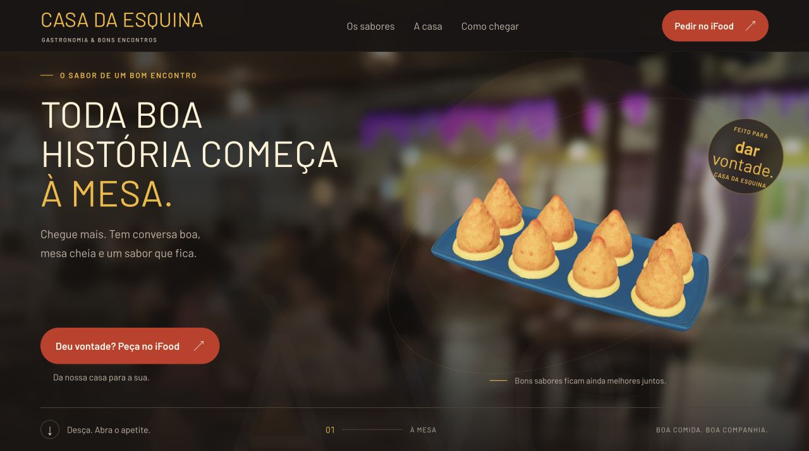
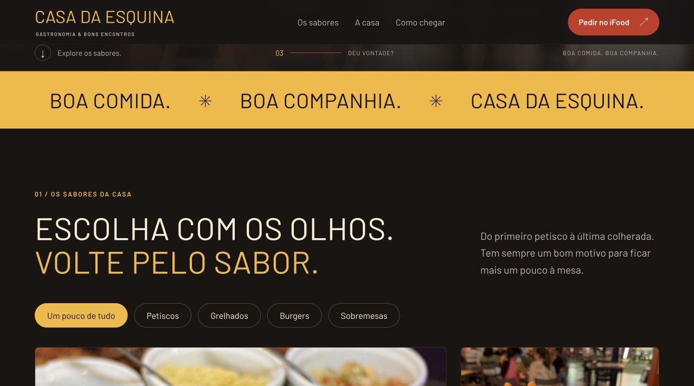

# template-restaurante

Template de site para restaurantes, com apresentação 3D controlada pela rolagem, fotos de pratos, filtros por categoria e chamadas para pedidos no iFood. Criado como estudo de redesign da **Casa da Esquina**, em Janaúba, MG, para compartilhar com a comunidade OneBitCode.

O projeto usa **HTML, CSS, JavaScript, Vite e Three.js**, sem framework de interface e sem backend. O pedido e o pagamento acontecem fora do site.

## Prévia do projeto

### Apresentação com modelos 3D



### Galeria de pratos



## Rodar localmente

Requer Node.js **22.12 ou superior** e npm.

```bash
git clone https://github.com/OneBitCodeBlog/template-restaurante.git
cd template-restaurante
npm ci
npm run dev -- --port 5173
```

- Site: [http://127.0.0.1:5173/](http://127.0.0.1:5173/)
- Styleguide: [http://127.0.0.1:5173/styleguide.html](http://127.0.0.1:5173/styleguide.html)

Use o servidor local: abrir o HTML diretamente pelo explorador de arquivos não carrega os módulos e modelos corretamente.

## O que tem no template

- Bandeja de coxinhas em 3D que gira e dá lugar a uma coxinha individual durante a rolagem.
- GLBs otimizados: **21,7 MB → 3,9 MB**, com Meshopt e texturas WebP.
- Enquadramento próprio para celular, preferência por movimento reduzido e foto alternativa caso WebGL falhe.
- Galeria de oito pratos com filtros e links “Quero experimentar”.
- Botão de pedido no cabeçalho e barra fixa contextual no celular.
- Apresentação da casa, galeria, prévia de vídeo e seção de depoimentos.
- Endereço com mapa, rotas, Instagram e WhatsApp.
- Styleguide em HTML com paleta, tipografia, fotografia e componentes.

## Personalizar

| O que mudar | Onde |
|---|---|
| Nome, pratos, textos, contatos, endereço e mapa | `index.html` |
| Cores, fontes, tamanhos e responsividade | `src/site.css` |
| Luz, câmera e transição dos modelos | `src/main.js` |
| Referência visual | `styleguide.html` |
| Fotos e fontes | `assets/` |
| Modelos usados no site | `public/models/` |
| Mídias de demonstração | `public/media/` |

### Pedidos

Os CTAs apontam provisoriamente para `https://www.ifood.com.br/`. Troque todas as ocorrências no `index.html` pelo link oficial do seu restaurante. Os botões dos pratos apenas abrem a plataforma: não adicionam itens a um carrinho nem integram a API do iFood.

### Tipografia

Os títulos usam a família **Veneer**, quando instalada localmente, com **Barlow** como alternativa. O arquivo comercial da Veneer não está incluído. Para usá-la na web, adicione um arquivo com licença adequada e atualize `assets/fonts/styleguide-fonts.css`, ou escolha outra fonte. Barlow está incluída com sua licença OFL.

### Conteúdo de exemplo

A foto panorâmica é ilustrativa e os depoimentos são fictícios, identificados na página. O vídeo é uma animação de seis segundos sobre uma foto do cardápio. Substitua esses exemplos pelas mídias e avaliações reais do seu restaurante antes de disponibilizar o site ao público. Atualize também os dados da Casa da Esquina e os contatos no styleguide.

## Build

```bash
npm run build
npm run preview
```

O site é gerado em `dist/`. O styleguide também entra no build como página separada. Publique essa pasta em uma hospedagem estática. Os caminhos atuais consideram publicação na raiz do domínio.

## Otimizar os modelos novamente

```bash
npm run optimize:models
```

O script lê `model-sources/`, preserva os originais e grava as versões leves em `public/models/`. Utiliza glTF Transform, Meshopt e Sharp; o decoder necessário já está integrado ao Three.js. Os números de tamanho e triângulos ficam em `pesquisa/model-optimization.json`.

## Estrutura

```text
├── index.html              # Página do restaurante
├── styleguide.html         # Guia visual navegável
├── src/                    # Estilos e interações
├── assets/                 # Fotos, logos e fontes
├── public/                 # Modelos e mídia servidos pelo Vite
├── model-sources/           # GLBs originais para reotimização
├── scripts/                # Pipeline de otimização
├── pesquisa/               # Inventário e relatórios
└── docs/                   # Notas de implementação
```

## Contribuir

Issues e pull requests são bem-vindos. Para alterações visuais, inclua uma captura de tela e confira desktop, celular e a preferência por movimento reduzido. Execute `npm run build` antes de enviar sua contribuição.

## Licença e créditos

O código e a documentação autorais usam a [licença MIT](LICENSE). Fotos, marcas, modelos 3D, fontes e outras mídias de terceiros **não são relicenciados pela MIT**. Consulte [ASSETS.md](ASSETS.md) para as origens e licenças disponíveis; substitua as mídias por arquivos que você tenha autorização para reutilizar no seu próprio restaurante.

O template é um estudo da comunidade e não representa uma integração oficial com iFood, Google ou os canais do restaurante.
